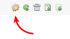
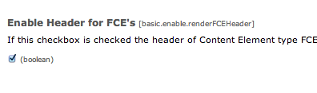

..  Editor configuration
    ...................................................
    * utf-8 with BOM as encoding
    * tab indent with 4 characters for code snippet.
    * optional: soft carriage return preferred.

.. include:: /Includes/MainInclude.txt

================================
Extras
================================

FCE Headers
================================

If you want your headers to show on the front end (or not), go to TemplaVoila (templavoila) in the extension manager, click on the configuration icon and then check (or uncheck) "Enable Headers for FCEs"

The TemplaVoila Framework and Busy Noggin Digital's Adaptive Profiles
================================

The Adaptive Profiles extension (bn_adaptiveprofiles) by Busy Noggin Digital is a great companion the the TemplaVoila Framework. Together they make adative / responsive web sites both easier to code and more powerful.

