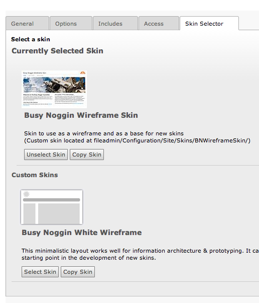

..  Editor configuration
    ...................................................
    * utf-8 with BOM as encoding
    * tab indent with 4 characters for code snippet.
    * optional: soft carriage return preferred.

.. include:: /Includes/MainInclude.txt

================================
Core Templates & Skins
================================

`CSS Zen Garden <http://www.csszengarden.com/>`_ does a good job of showing how much a site can change simply through modifying its CSS.

The flexibility provided by CSS is magnified when you combine it with the ability of TypoScript to change the site's underlying HTML structure and to control the maximum width of images and the widths of columns in various content areas.

The TemplaVoila Framework takes advantage of CSS inheritance and the similar behavior of TypoScript. It uses a set of core templates which are then modified by skins. This, combined with the included columns and modules, allows for the page templates in the TemplaVoila Framework to be used for vastly different visual designs without creating and remapping new templates.

The Framework is so flexible that over 95% of the visual designs on the web can be built using only the Framework's core templates.

**These four site designs use the same template in the TemplaVoila Framework.**

.. list-table::

	*
		-
			.. figure:: Images/fogo.jpg
				:width: 280
				:alt: Example Page

		-
			.. figure:: Images/fusion.jpg
				:width: 280
				:alt: Example Page

	*
		-
			.. figure:: Images/noggin.jpg
				:width: 280
				:alt: Example Page

		-
			.. figure:: Images/r1soft.jpg
				:width: 280
				:alt: Example Page

Available Skins
================================

There are a number of version 1 skins in the TYPO3 extension repository (TER). These skins are now considered deprecated, but will work with the current version 2 provided they have been updated with this code as the first line in their constants field.

plugin.tx_templavoilaframework.renderMode = 1

However, we do not recommend using the version 1 skins for any new site development. Rather, you should develop a custom skin for your site using version 2 code. There is a Busy Noggin Wireframe Skin based on version 2 code. This wireframe skin can be used as a starting point for new skins. This skin will be in the TER when version 2 of the Framework is in the TER. The skin is included in the download of the pre-release version 2 of the Framework located at `www.busynoggin.com/fileadmin/extensions/TVFW2PreRelease.zip <http://www.busynoggin.com/fileadmin/extensions/TVFW2PreRelease.zip>`_.

Skins can be extensions or simply reside in your custom skin directory. You only need to make a skin an extension if you intend to distribute it via the TYPO3 TER. Therefore, it is likely that all of your skins will reside in your custom skin directory.

You can switch between skins with the Skin Selector.

    // @todo-ron Initially update Wireframe skin and T-Bone starter in the TER with constant to run with TVFW v2.

// @todo-ron Update Wireframe skin in the TER to the v2 skin. Upgrade AT-Bone starter to v2 and set both to require v2

// @todo-ron add extension key for BN Wireframe and download instructions

// @todo-ron take out dated items when code is in the TER.

.. // @todo-ron Make zen garden come up in exernal window.