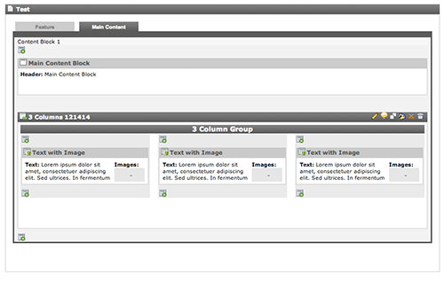

..  Editor configuration
    ...................................................
    * utf-8 with BOM as encoding
    * tab indent with 4 characters for code snippet.
    * optional: soft carriage return preferred.

.. include:: /Includes/MainInclude.txt

================================
Editor Experience & Back End Layout
================================

When working with this framework, you will notice the back end layout of the content in the TemplaVoila page module looks different than you may be used to.

- Content is placed in tabs corresponding to page content areas which makes for much less scrolling when editing content.
- Overall, the visual noise an editor usually sees when editing a TemplaVoila page has been greatly reduced.

**1024x768 Monitors**

If you have a smaller monitor and have a page with columns or modules, you may find on the backend that the content in the columns may overlap. This is because there is not enough room to display all three frames of the TYPO3 backend and the columns.

If this is your experience, you can click on the vertical bar between the page tree and the content area. This will collapse the page tree frame and give enough room in the content area for the columns. When you are done editing you can click the bar again and the page tree will appear.

**Back-End Translations**

Currently English, German, Dutch and Spanish are available to the back-end user.

**Custom Layouts**

It is possible for the developer to use his own back end layout by attaching a file to the template object. However, we recommend staying with the layout provided by the Framework to provide a consistent interface for training from site to site.
