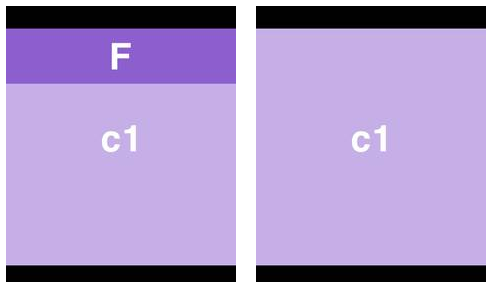
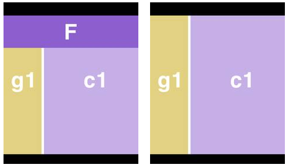
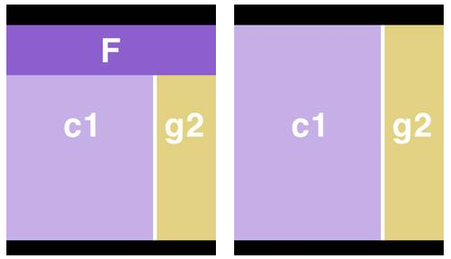
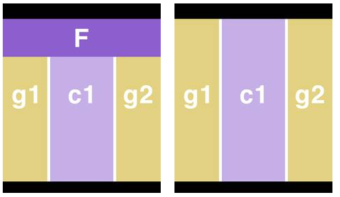

..  Editor configuration
    ...................................................
    * utf-8 with BOM as encoding
    * tab indent with 4 characters for code snippet.
    * optional: soft carriage return preferred.

.. include:: /Includes/MainInclude.txt

================================
F1 Series Page Templates
================================

The F1 Series of templates always have a:

- Header
- Footer
- Feature Content (but will only show if a user has placed content in it. See magical feature)
- Main Content Area

Depending on the template it may also include one or two areas of generated content.

Graphical representations of the templates
================================

Please note that the feature area will only show if a user places content in it and the feature area does not have to span the entire top of the layout.

Templates F1a, F1b and F1c
--------------------------------
These templates each contain a header, footer, feature content (F) and main content (c1). They are identical except for the ID on the body tag (f1a, f1b, f1c). These ID's allow them to be targeted independently with CSS.

Left is when feature content is entered and right is when it is not.

Template F1d
--------------------------------

This is the same as F1a except it has an area for generated content (g1) that comes just before the main content (c1). This area pulls from the sysFolder indicated by the TypoScript constant "generatedContent-1.source." It has an ID on the body tag of "f1d."

Left is when feature content is entered and right is when it is not.

Template F1e
--------------------------------

Identical to F1d except the generated content (g2) comes after the main content (c1) and comes from the sysFolder indicated by the TypoScript constant "generatedContent-2.source" and it is an ID of "f1e" on the body tag.

Left is when feature content is entered and right is when it is not.

Template F1f
--------------------------------

Identical to f1d except it has two areas for generated content (g1 & g2) and an ID of "f1f" on the body.

Left is when feature content is entered and right is when it is not.

// @todo-ron need to finish