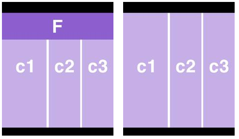
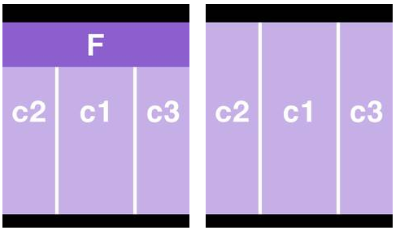

..  Editor configuration
    ...................................................
    * utf-8 with BOM as encoding
    * tab indent with 4 characters for code snippet.
    * optional: soft carriage return preferred.

.. include:: /Includes/MainInclude.txt

================================
F3 Series Page Templates
================================

The F3 Series of templates always have a:

- Header
- Footer
- Feature Content (but will only show if a user has placed content in it. See magical feature)
- Main Content Area
- Secondary Content Area
- Additional Content Area

Graphical representations of the templates
================================

Please note that the feature area will only show if a user places content in it and the feature area does not have to span the entire top of the layout.

- Templates F3a & F3b
- Templates F3c & F3d

Templates F3a and F3b
================================

These templates each contain a header, footer, feature content (F), main content (c1), secondary content (c2)  and addtional content (c3). They are identical except for the ID on the body tag (f3a, f3b). These ID's allow them to be targeted independently with CSS.

Left is when feature content is entered and right is when it is not.

Templates F3c and F3d
================================

These are identical to template F3a except the order of the main content (c10 and the secondary content (c2)  has been switched. Also the IDs on the body tags are different (F3c, F3d)

Left is when feature content is entered and right is when it is not.

// @todo-ron need to finish