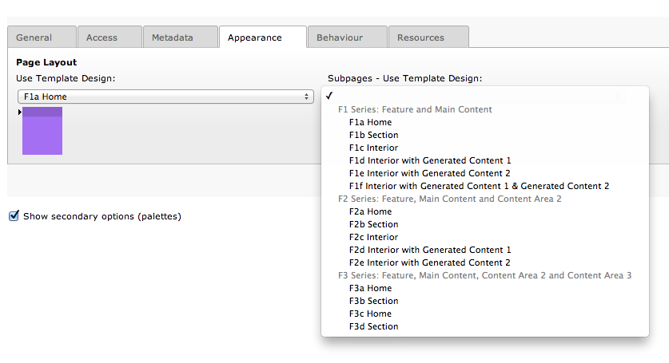

..  Editor configuration
    ...................................................
    * utf-8 with BOM as encoding
    * tab indent with 4 characters for code snippet.
    * optional: soft carriage return preferred.

.. include:: /Includes/MainInclude.txt

================================
Choosing a Page Template
================================

The TemplaVoila Framework comes with 15 basic page templates. The design of your site will determine how many of those templates are needed for your site.  These templates are selected just like any TemplaVoila page templates. Go to the appearance tab in the page properties and select the template you need.

The types of content you will find in your templates are:

**Main Content**
This is content that is central to the page and unique to the page. It is why the page exists.

**Feature**
This is content unique to a page and that falls right after the header. Often it spans the entire width of the page but does not have to. If you do not put content into the feature, the feature will not show up.

**Additional Content Blocks**
This content is unique to the page but secondary to the main content.

**Generated Content Blocks**
These provide content that is automatically generated and displayed on multiple pages in a site. This can include any or all of the following: menus, links, ads, teasers, etc. Generated content is not edited on the page, but rather in places the developer has set up to contain the content. Normally this is in the folders in the page tree named Generated Content 1 and Generated Content 2.