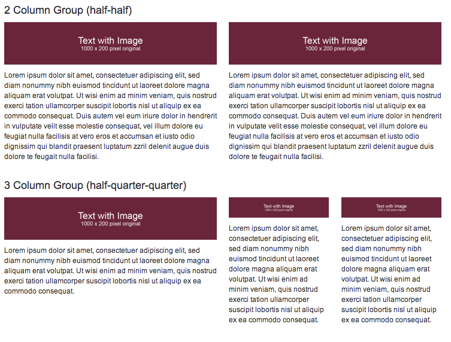
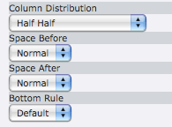
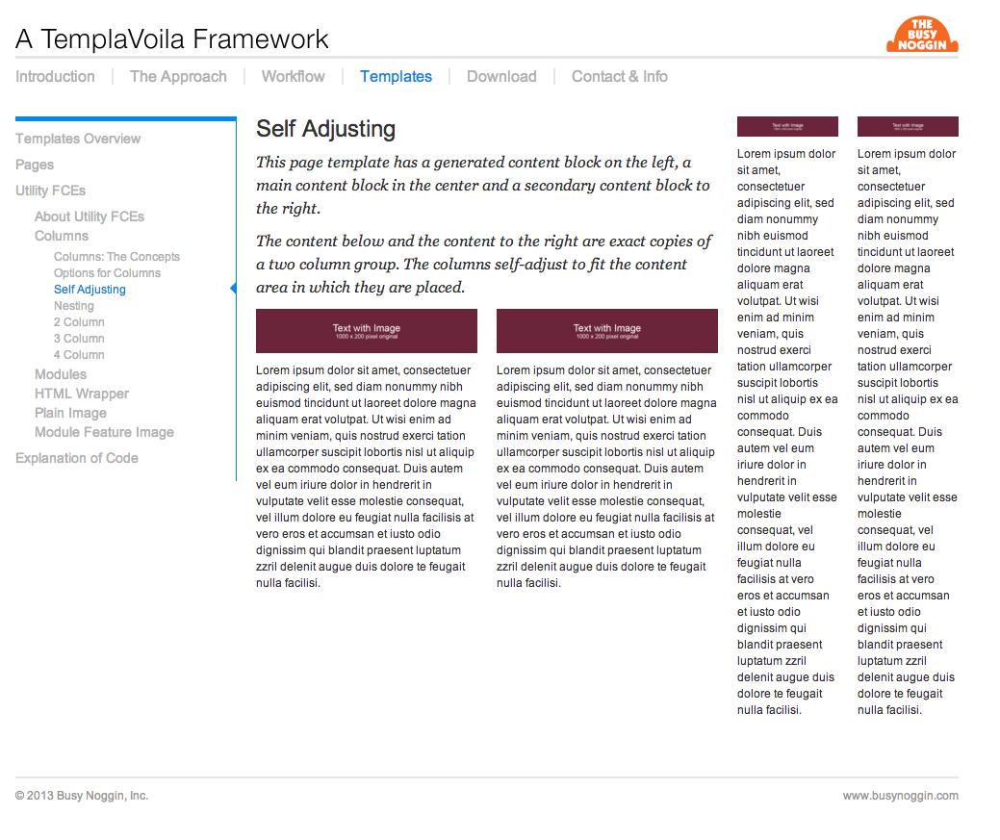
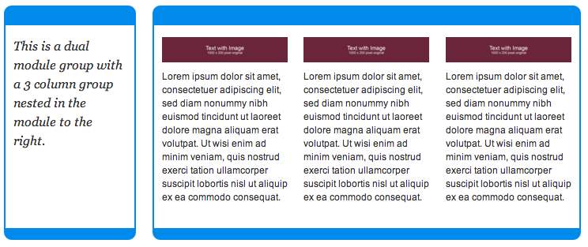

..  Editor configuration
    ...................................................
    * utf-8 with BOM as encoding
    * tab indent with 4 characters for code snippet.
    * optional: soft carriage return preferred.

.. include:: /Includes/MainInclude.txt

================================
Working with Columns
================================

Column groups are Flexible Content Elements (FCEs) for displaying content in columns inside of page content blocks. They can be used to create special layouts instead of generating more main page templates.

Columns groups have options and also automatically adjust their width and max image widths to the page content block in which they are placed. Columns can also be nested inside modules and other columns (up to one level).

There are 2, 3 and 4 columns groups provied with the Framework.

**Examples of Columns**
Below are is a dual column group (set half-half) and a triple column group (set half-quarter-quarter). Notice the image widths are automatically adjusted with changes to the columns.

Options for Columns
================================

The options for columnns can be adjusted by editing the column group.

**Distribution**: This is how the columns are proportioned (half-half, quarter-quarter-half", etc.)

**Space Before and Space After:** Use these to add more space before or after the entire group. DEPRECATED: These two settings will be eliminated in the next version of the QuickSIte. They were basically unneeded as space before and after can be set in the same way as with all other TYPO3 content elements.

**Bottom Rule:** Adds a class called "columnGroupRule" which is normally used to control whether a bottom rule is displayed. A default for the entire site of 1 (on) or 0 (off) can be set in the skin's TypoScript constants. The user can override that setting on a per page basis.

**Gutter Width:** This is an option that is only set as a global value and cannot be adjust on column instances individually. It gives how many pixel of gutter should be between columns or modules. It is set in the TypoScript file for the skin.

Self Adjusting
================================

This page template has a generated content block on the left, a main content block in the center and a secondary content block to the right.

The content below and the content to the right are exact copies of a two column group. The columns self-adjust to fit the content area in which they are placed.

Nesting
================================

Column Groups can be nested inside of modules or other columns.

**Note on Nesting:** Modules should not be nested or weird things will happen. Columns should only be nested one level as anything beyond will break your layout.

// @todo-ron need to finish