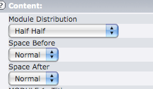
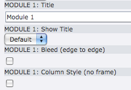

..  Editor configuration
    ...................................................
    * utf-8 with BOM as encoding
    * tab indent with 4 characters for code snippet.
    * optional: soft carriage return preferred.

.. include:: /Includes/MainInclude.txt

================================
Working with Modules
================================

Module groups are Flexible Content Elements (FCEs) for displaying content in modules inside of page content blocks. They can be used to create special layouts instead of generating more main page templates.

Module groups have options and also automatically adjust their width and max image widths to the page content block in which they are placed. Columns can also be nested inside modules (up to one level).

A Note on Module Backgrounds
================================
Visually it is important to keep the modules within a group the same height, but it is a challenge. This stems from the age-old issue of equal height columns in standards-based sites. The main approaches to solving this are faux background techinques and JavaScript. Within this framework we use JavaScript to to take care of equal heights in module groups.

Options for Modules
================================
Here are the various options for module groups and their individual modules. The options for modules can be adjusted by editing the module group.

**Option for the module group**

**Distribution:** This is how the modules are porportioned ("Half Half," "Quarter Quarter Half", etc.)

**Options on each module**

**Show Title:** A value is set globally to show or not show module titles by default. The default can be overridden by the user on a per page basis.

**Bleed:** Causes the content to bleed. Adds a class to the module body for bleed and changes the max image width. See also module feature image.

**Unframed:** When checked the module will look like a column. Allows you visually to have columns next to and between modules.

// @todo-ron need to finish